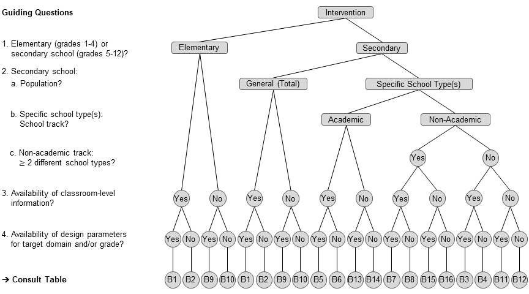
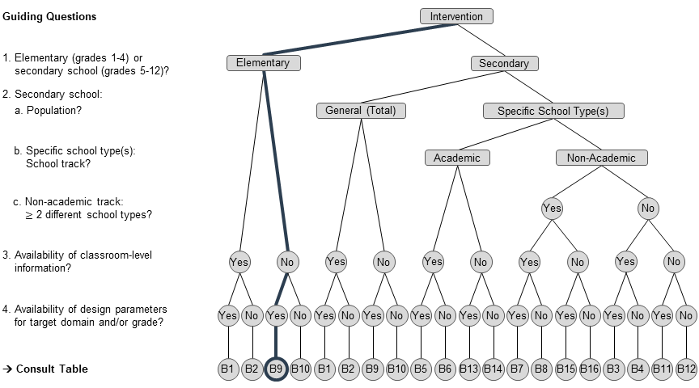
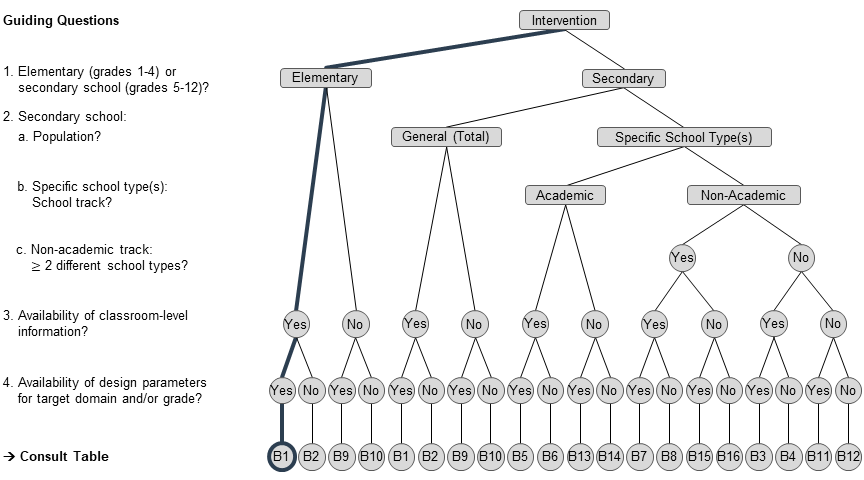
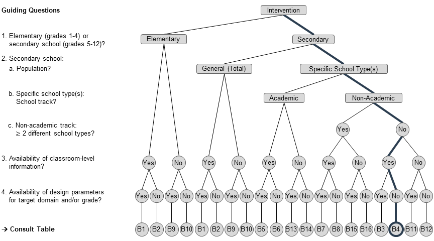
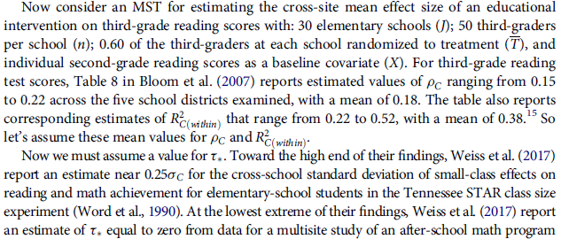
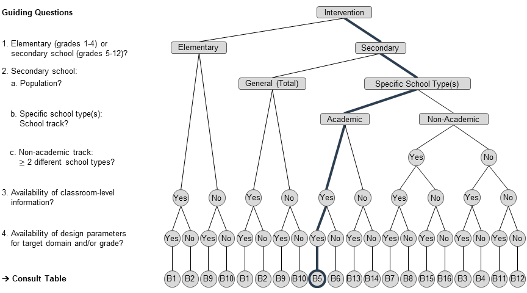

```{r setup, include=FALSE}
knitr::opts_chunk$set(echo = TRUE)
```

```{r klippy, echo=FALSE, include=TRUE}
klippy::klippy(position = c('top', 'right'))
```

&nbsp;  
This document accompanies the workshop on cluster randomized trials led by Larry V. Hedges, Sophie E. Stallasch & Martin Brunner at the University of Potsdam on June 9-10, 2022. It provides the corresponding R code for the exercises on power analysis done during the workshop with the 'PowerUp!' Excel tool by @dong_maynard2013, which is accessible at the ["Causal Evaluation" website](https://www.causalevaluation.org/power-analysis.html). Here, we will use the R implementation of 'PowerUp!', namely the `PowerUpR` package built by @bulus_etal2021.


# Setup
You can install the latest version of `PowerUpR` (currently, this is version 1.1.0) from CRAN. Throughout this tutorial, we will also use a bunch of `tidyverse` [@wickham_etal2019] functions, as well as the `kableExtra` [@zhu2021] package, so make sure you have installed these packages (for details on the versions used here, see the 'Session Info' section at the end of this document).

```{r, message=FALSE, warning=FALSE}
# -- load packages (or install from CRAN if not installed)
packages <- c("PowerUpR", "tidyverse", "kableExtra")

invisible(
  lapply(packages,
         function(x) {
           if (!require(x, character.only = TRUE)) {
             install.packages(x, dependencies = TRUE); require(x, character.only = TRUE)}
         }
  )
)
```


# Multilevel Design Parameters

To plan rigorous intervention studies on student achievement with sufficient statistical power, reliable estimates of multilevel design parameters are critical. These design parameters mirror the (clustered) variance structure of the outcome, including intraclass correlation coefficients ρ that quantify achievement differences between clusters and *R*^2^ values that quantify the amounts of explained variance by covariates at the various levels. Design parameters should match the target population of the intervention, the specific hierarchical data structure and the achievement outcome under investigation.

There are multiple resources of empirical values for ρ and *R*^2^ for student achievement. A review of existing international and German research on design parameters can be found in @stallasch_etal2021. One useful collection of estimates for the United States is, for instance, the ["Online Intraclass Correlation Database"](http://stateva.ci.northwestern.edu/) created by Hedges and colleagues and hosted by the Institute for Policy Research of the Northwestern University.

## Design Parameters for the German School Context
For the majority of workshop exercises, we draw on the compilation of ρ and *R*^2^ values (and corresponding standard errors) published in [@stallasch_etal2021](https://www.tandfonline.com/doi/full/10.1080/19345747.2020.1823539).
Based on three longitudinal German large-scale assessments (NEPS, PISA-I+, and DESI) that provide achievement data across the entire school career (grades 1 to 12), the authors generated design parameters that apply to   

  (I) several student populations,  
  (II) both three-level designs (i.e., students at level [L] 1 within classrooms at L2 within schools at L3) as well as two-level designs (i.e., students at L1 within schools at L3), and  
  (III) a broad array of domains.  
    
*R*^2^ values at each level are available for three covariate sets: (a) pretest scores, (b) sociodemographic characteristics (comprising students' gender and migration background, as well as parents' educational attainment, and families' HISEI), and (c) the combination thereof. 

The design parameters are provided via an interactive Excel file (Supplemental Online Material B) that comes with a detailed introduction on the application scopes of the various sets of estimates. This document can be downloaded from the [OSF](https://osf.io/2w8nt/) or the [Journal's website](https://www.tandfonline.com/doi/suppl/10.1080/19345747.2020.1823539?scroll=top).   

To facilitate the workflow in R (e.g., to avoid time-consuming and error-prone C&P of estimates), an .rda file  that encloses the full compilation of design parameters (as a list of data frames) is shared in [this course's repository on github](https://github.com/sophiestallasch/2022-workshop-CRT) which is ready to be directly loaded:  
```{r}
# load design parameters from github
load(url("https://github.com/sophiestallasch/2022-workshop-CRT/blob/main/data/multides1.rda?raw=true"))
```
If you run into problems, [click here](https://github.com/sophiestallasch/2022-workshop-CRT/blob/main/data/multides1.rda?raw=true) to download the data to your local machine and then load it into R.
```{r}
# inspect list
summary(multides1)
```

The list contains 16 data frames, that can be grouped into two broad classes:  

* **Point Estimates and Standard Errors**  
Data frames B1, B3, B5, B7, B9, B11, B13, and B15 contain the full sets of (population-specific) empirical estimates of design parameters for each domain, subdomain, and grade, along with their standard errors.  

* **Normative Distributions**  
Data frames B2, B4, B6, B8, B10, B12, B14, and B16 (i.e., data frames ending with "_ND") contain (population-specific) normative distributions (i.e., minimum, 25th percentile, median, 75th percentile, and maximum) of those design parameters summarized across domains and/or grades. These distributions can serve as guesstimates to plan studies whose target domain and/or grade is not covered in @stallasch_etal2021.  


### Overview of Data Frames

<style type="text/css">
.tg  {border-collapse:collapse;border-spacing:0;}
.tg td{border-color:black;border-style:solid;border-width:1px;font-family:Arial, sans-serif;font-size:14px;
  overflow:hidden;padding:1px 2px;word-break:normal;}
.tg th{border-color:black;border-style:solid;border-width:1px;font-family:Arial, sans-serif;font-size:14px;
  font-weight:normal;overflow:hidden;padding:1px 2px;word-break:normal;}
.tg .tg-d80r{border-color:#9b9b9b;font-family:Arial, Helvetica, sans-serif !important;font-size:10px;text-align:center;
  vertical-align:middle}
.tg .tg-6hvx{border-color:#9b9b9b;font-family:Arial, Helvetica, sans-serif !important;font-size:10px;text-align:left;
  vertical-align:middle}
.tg .tg-sp0n{background-color:#efefef;border-color:#9b9b9b;font-family:Arial, Helvetica, sans-serif !important;font-size:10px;
  text-align:left;vertical-align:middle}
.tg .tg-sqw7{background-color:#2c3e50;border-color:#9b9b9b;color:#ffffff;font-family:Arial, Helvetica, sans-serif !important;
  font-size:10px;font-weight:bold;text-align:left;vertical-align:middle}
.tg .tg-snkp{background-color:#2c3e50;border-color:#9b9b9b;color:#ffffff;font-family:Arial, Helvetica, sans-serif !important;
  font-size:10px;font-weight:bold;text-align:center;vertical-align:middle}
.tg .tg-vv2j{background-color:#efefef;border-color:#9b9b9b;font-family:Arial, Helvetica, sans-serif !important;font-size:10px;
  text-align:center;vertical-align:middle}
</style>
<table class="tg" style="undefined;table-layout: fixed; width: 828px">
<colgroup>
<col style="width: 131px">
<col style="width: 201px">
<col style="width: 41px">
<col style="width: 211px">
<col style="width: 81px">
<col style="width: 51px">
<col style="width: 61px">
<col style="width: 51px">
</colgroup>
<thead>
  <tr>
    <th class="tg-sqw7" rowspan="2">Data frame</th>
    <th class="tg-sqw7" rowspan="2">Description</th>
    <th class="tg-sqw7" rowspan="2">Grades</th>
    <th class="tg-sqw7" rowspan="2">Scope of application</th>
    <th class="tg-sqw7" rowspan="2">Target design</th>
    <th class="tg-snkp" colspan="3">Hierarchical structure</th>
  </tr>
  <tr>
    <th class="tg-snkp">L1</th>
    <th class="tg-snkp">L2</th>
    <th class="tg-snkp">L3</th>
  </tr>
</thead>
<tbody>
  <tr>
    <td class="tg-6hvx" rowspan="2">B1_General</td>
    <td class="tg-6hvx" rowspan="2">Design parameters for the general (total) student population</td>
    <td class="tg-6hvx">1-10</td>
    <td class="tg-6hvx" rowspan="2">Nationwide/ across all school types</td>
    <td class="tg-6hvx">3L-(MS)CRT</td>
    <td class="tg-d80r">Students</td>
    <td class="tg-d80r">Classrooms</td>
    <td class="tg-d80r">Schools</td>
  </tr>
  <tr>
    <td class="tg-6hvx">11-12</td>
    <td class="tg-6hvx">2L-MSIRT/CRT</td>
    <td class="tg-d80r">Students</td>
    <td class="tg-d80r">-</td>
    <td class="tg-d80r">Schools</td>
  </tr>
  <tr>
    <td class="tg-sp0n" rowspan="2">B2_General_ND</td>
    <td class="tg-sp0n" rowspan="2">Normative distributions of B1</td>
    <td class="tg-sp0n">1-10</td>
    <td class="tg-sp0n" rowspan="2">Nationwide/ across all school types; target domain and/or grade not covered</td>
    <td class="tg-sp0n">3L-(MS)CRT</td>
    <td class="tg-vv2j">Students</td>
    <td class="tg-vv2j">Classrooms</td>
    <td class="tg-vv2j">Schools</td>
  </tr>
  <tr>
    <td class="tg-sp0n">11-12</td>
    <td class="tg-sp0n">2L-MSIRT/CRT</td>
    <td class="tg-vv2j">Students</td>
    <td class="tg-vv2j">-</td>
    <td class="tg-vv2j">Schools</td>
  </tr>
  <tr>
    <td class="tg-6hvx" rowspan="2">B3_Adjusted</td>
    <td class="tg-6hvx" rowspan="2">Design parameters for the general (total) student population, adjusted for mean-level differences between school types</td>
    <td class="tg-6hvx">5-10</td>
    <td class="tg-6hvx" rowspan="2">1 school type in the non-academic track</td>
    <td class="tg-6hvx">3L-(MS)CRT</td>
    <td class="tg-d80r">Students</td>
    <td class="tg-d80r">Classrooms</td>
    <td class="tg-d80r">Schools</td>
  </tr>
  <tr>
    <td class="tg-6hvx">11-12</td>
    <td class="tg-6hvx">2L-MSIRT/CRT</td>
    <td class="tg-d80r">Students</td>
    <td class="tg-d80r">-</td>
    <td class="tg-d80r">Schools</td>
  </tr>
  <tr>
    <td class="tg-sp0n" rowspan="2">B4_Adjusted_ND</td>
    <td class="tg-sp0n" rowspan="2">Normative distributions of B3</td>
    <td class="tg-sp0n">5-10</td>
    <td class="tg-sp0n" rowspan="2">1 school type in the non-academic track; target domain and/or grade not covered</td>
    <td class="tg-sp0n">3L-(MS)CRT</td>
    <td class="tg-vv2j">Students</td>
    <td class="tg-vv2j">Classrooms</td>
    <td class="tg-vv2j">Schools</td>
  </tr>
  <tr>
    <td class="tg-sp0n">11-12</td>
    <td class="tg-sp0n">2L-MSIRT/CRT</td>
    <td class="tg-vv2j">Students</td>
    <td class="tg-vv2j">-</td>
    <td class="tg-vv2j">Schools</td>
  </tr>
  <tr>
    <td class="tg-6hvx" rowspan="2">B5_Academic</td>
    <td class="tg-6hvx" rowspan="2">Design parameters for the academic track</td>
    <td class="tg-6hvx">5-10</td>
    <td class="tg-6hvx" rowspan="2">Academic track school ("Gymnasium")</td>
    <td class="tg-6hvx">3L-(MS)CRT</td>
    <td class="tg-d80r">Students</td>
    <td class="tg-d80r">Classrooms</td>
    <td class="tg-d80r">Schools</td>
  </tr>
  <tr>
    <td class="tg-6hvx">11-12</td>
    <td class="tg-6hvx">2L-MSIRT/CRT</td>
    <td class="tg-d80r">Students</td>
    <td class="tg-d80r">-</td>
    <td class="tg-d80r">Schools</td>
  </tr>
  <tr>
    <td class="tg-sp0n" rowspan="2">B6_Academic_ND</td>
    <td class="tg-sp0n" rowspan="2">Normative distributions of B5</td>
    <td class="tg-sp0n">5-10</td>
    <td class="tg-sp0n" rowspan="2">Academic track school ("Gymnasium"); target domain and/or grade not covered</td>
    <td class="tg-sp0n">3L-(MS)CRT</td>
    <td class="tg-vv2j">Students</td>
    <td class="tg-vv2j">Classrooms</td>
    <td class="tg-vv2j">Schools</td>
  </tr>
  <tr>
    <td class="tg-sp0n">11-12</td>
    <td class="tg-sp0n">2L-MSIRT/CRT</td>
    <td class="tg-vv2j">Students</td>
    <td class="tg-vv2j">-</td>
    <td class="tg-vv2j">Schools</td>
  </tr>
  <tr>
    <td class="tg-6hvx" rowspan="2">B7_Non-Academic</td>
    <td class="tg-6hvx" rowspan="2">Design parameters for the non-academic track</td>
    <td class="tg-6hvx">5-10</td>
    <td class="tg-6hvx" rowspan="2">2+ different school types in the non-academic track</td>
    <td class="tg-6hvx">3L-(MS)CRT</td>
    <td class="tg-d80r">Students</td>
    <td class="tg-d80r">Classrooms</td>
    <td class="tg-d80r">Schools</td>
  </tr>
  <tr>
    <td class="tg-6hvx">11-12</td>
    <td class="tg-6hvx">2L-MSIRT/CRT</td>
    <td class="tg-d80r">Students</td>
    <td class="tg-d80r">-</td>
    <td class="tg-d80r">Schools</td>
  </tr>
  <tr>
    <td class="tg-sp0n" rowspan="2">B8_Non-Academic_ND</td>
    <td class="tg-sp0n" rowspan="2">Normative distributions of B7</td>
    <td class="tg-sp0n">5-10</td>
    <td class="tg-sp0n" rowspan="2">2+ different school types in the non-academic track; target domain and/or grade not covered</td>
    <td class="tg-sp0n">3L-(MS)CRT</td>
    <td class="tg-vv2j">Students</td>
    <td class="tg-vv2j">Classrooms</td>
    <td class="tg-vv2j">Schools</td>
  </tr>
  <tr>
    <td class="tg-sp0n">11-12</td>
    <td class="tg-sp0n">2L-MSIRT/CRT</td>
    <td class="tg-vv2j">Students</td>
    <td class="tg-vv2j">-</td>
    <td class="tg-vv2j">Schools</td>
  </tr>
  <tr>
    <td class="tg-6hvx">B9_General-2l</td>
    <td class="tg-6hvx">Design parameters for the general (total) student population; for two-level designs</td>
    <td class="tg-6hvx">1-10</td>
    <td class="tg-6hvx">Nationwide/ across all school types</td>
    <td class="tg-6hvx">2L-MSIRT/CRT</td>
    <td class="tg-d80r">Students</td>
    <td class="tg-d80r">-</td>
    <td class="tg-d80r">Schools</td>
  </tr>
  <tr>
    <td class="tg-sp0n">B10_General-2l_ND</td>
    <td class="tg-sp0n">Normative distributions of B9</td>
    <td class="tg-sp0n">1-10</td>
    <td class="tg-sp0n">Nationwide/ across all school types; target domain and/or grade not covered</td>
    <td class="tg-sp0n">2L-MSIRT/CRT</td>
    <td class="tg-vv2j">Students</td>
    <td class="tg-vv2j">-</td>
    <td class="tg-vv2j">Schools</td>
  </tr>
  <tr>
    <td class="tg-6hvx">B11_Adjusted-2l</td>
    <td class="tg-6hvx">Design parameters for the general (total) student population, adjusted for mean-level differences between school types; for two-level designs</td>
    <td class="tg-6hvx">5-10</td>
    <td class="tg-6hvx">1 school type in the non-academic track</td>
    <td class="tg-6hvx">2L-MSIRT/CRT</td>
    <td class="tg-d80r">Students</td>
    <td class="tg-d80r">-</td>
    <td class="tg-d80r">Schools</td>
  </tr>
  <tr>
    <td class="tg-sp0n">B12_Adjusted-2l_ND</td>
    <td class="tg-sp0n">Normative distributions of B11</td>
    <td class="tg-sp0n">5-10</td>
    <td class="tg-sp0n">1 school type in the   non-academic track; target domain and/or grade not covered</td>
    <td class="tg-sp0n">2L-MSIRT/CRT</td>
    <td class="tg-vv2j">Students</td>
    <td class="tg-vv2j">-</td>
    <td class="tg-vv2j">Schools</td>
  </tr>
  <tr>
    <td class="tg-6hvx">B13_Academic-2l</td>
    <td class="tg-6hvx">Design parameters for the academic track; for two-level designs</td>
    <td class="tg-6hvx">5-10</td>
    <td class="tg-6hvx">Academic track school ("Gymnasium")</td>
    <td class="tg-6hvx">2L-MSIRT/CRT</td>
    <td class="tg-d80r">Students</td>
    <td class="tg-d80r">-</td>
    <td class="tg-d80r">Schools</td>
  </tr>
  <tr>
    <td class="tg-sp0n">B14_Academic-2l_ND</td>
    <td class="tg-sp0n">Normative distributions of B13</td>
    <td class="tg-sp0n">5-10</td>
    <td class="tg-sp0n">Academic track school ("Gymnasium"); target domain and/or grade not covered</td>
    <td class="tg-sp0n">2L-MSIRT/CRT</td>
    <td class="tg-vv2j">Students</td>
    <td class="tg-vv2j">-</td>
    <td class="tg-vv2j">Schools</td>
  </tr>
  <tr>
    <td class="tg-6hvx">B15_Non-Academic-2l</td>
    <td class="tg-6hvx">Design parameters for the non-academic track; for two-level designs</td>
    <td class="tg-6hvx">5-10</td>
    <td class="tg-6hvx">2+ different school types in the non-academic track</td>
    <td class="tg-6hvx">2L-MSIRT/CRT</td>
    <td class="tg-d80r">Students</td>
    <td class="tg-d80r">-</td>
    <td class="tg-d80r">Schools</td>
  </tr>
  <tr>
    <td class="tg-sp0n">B16_Non-Academic-2l_ND</td>
    <td class="tg-sp0n">Normative distributions of B15</td>
    <td class="tg-sp0n">5-10</td>
    <td class="tg-sp0n">2+ different school types in the   non-academic track; target domain and/or grade not covered</td>
    <td class="tg-sp0n">2L-MSIRT/CRT</td>
    <td class="tg-vv2j">Students</td>
    <td class="tg-vv2j">-</td>
    <td class="tg-vv2j">Schools</td>
  </tr>
</tbody>
</table>

&nbsp;  
Further, @stallasch_etal2021 created a flow chart to guide researchers through the choice of appropriate design parameters as a function of key characteristics of the target intervention.




### Structure of Data Frames {.tabset}

#### Point Estimates and Standard Errors

Data frames that contain the point estimates and standard errors (i.e., B1, B3, B5, B7, B9, B11, B13, and B15) are structured as follows.


| Variable             | Description                                                                                     |
|:---------------------|:------------------------------------------------------------------------------------------------|
| domain               | Domain of achievement outcome (for details, see section 'Achievement Domains')                  |
| subdomain            | Subdomain of achievement outcome (for details, see section 'Achievement Domains')               |
| grade                | Grade of achievement outcome                                                                    |
| study                | Large-scale assessment study (and cohort): 'NEPS-SC2', 'NEPS-SC3', 'NEPS-SC4', 'PISA-I+', 'DESI'|
| wave                 | Wave of large-scale assessment study                                                            |
| model                | Hierarchical structure of specified multilevel model: '3l', '2l'                                |
| icc_l2.est           | ICC at classroom level ρ~L2~                                                                    |
| icc_l2.se            | SE   of ICC at classroom level *SE*(ρ~L2~)                                                      |
| icc_l3.est           | ICC at school level ρ~L3~                                                                       |
| icc_l3.se            | SE of ICC at school level *SE*(ρ~L3~)                                                           |
| r2_l1_pretest.est    | Explained variance by a pretest at student level *R*^2^~L1~                                     |
| r2_l1_pretest.se     | SE of explained variance by a pretest at student level *SE*(*R*^2^~L1~)                         |
| r2_l2_pretest.est    | Explained variance by a pretest at classroom level *R*^2^~L2~                                   |
| r2_l2_pretest.se     | SE of explained variance by a pretest at classroom level *SE*(*R*^2^~L2~)                       |
| r2_l3_pretest.est    | Explained variance by a pretest at school level *R*^2^~L3~                                      |
| r2_l3_pretest.se     | SE of explained variance by a pretest at school level *SE*(*R*^2^~L3~)                          |
| r2_l1_ses.est        | Explained variance by sociodemographics at student level *R*^2^~L1~                             |
| r2_l1_ses.se         | SE of explained variance by sociodemographics at student level *SE*(*R*^2^~L1~)                 |
| r2_l2_ses.est        | Explained variance by sociodemographics at classroom level *R*^2^~L2~                           |
| r2_l2_ses.se         | SE of explained variance by sociodemographics at classroom level *SE*(*R*^2^~L2~)               |
| r2_l3_ses.est        | Explained variance by sociodemographics at school level *R*^2^~L3~                              |
| r2_l3_ses.se         | SE of explained variance by sociodemographics at school level *SE*(*R*^2^~L3~)                  |
| r2_l1_pretestses.est | Explained variance by a pretest and sociodemographics at student level *R*^2^~L1~               |
| r2_l1_pretestses.se  | SE of explained variance by a pretest and sociodemographics at student level *SE*(*R*^2^~L1~)   |
| r2_l2_pretestses.est | Explained variance by a pretest and sociodemographics at classroom level *R*^2^~L2~             |
| r2_l2_pretestses.se  | SE of explained variance by a pretest and sociodemographics at classroom level *SE*(*R*^2^~L2~) |
| r2_l3_pretestses.est | Explained variance by a pretest and sociodemographics at school level *R*^2^~L3~                |
| r2_l3_pretestses.se  | SE of explained variance by a pretest and sociodemographics at school level *SE*(*R*^2^~L3~)    |


Note that three-level design parameters (students at L1 within classrooms at L2 within schools at L3) were estimated for grades 1 to 10 only. For grades 11 to 12, no L2 estimates are available as 11th and 12th graders did not attend intact classrooms, but rather the grouping of students varied depending on the subject taught. Therefore, two-level design parameters (students at L1 within schools at L3) were estimated instead. Two-level equivalents for grades 1 to 10 (i.e., ignoring classroom-level clustering) are also provided; you can access them in the data frames labeled with '-2l'. Keep in mind that the top level (which is always the school level) is consistently indicated as '_l3' across all data frames; irrespective of whether L2 estimates were estimated (i.e., also for two-level designs). 
Detailed information on the provided design parameters and underlying analysis models can be retrieved from @stallasch_etal2021. 

#### Normative Distributions


Data frames that contain normative distributions (i.e., B2, B4, B6, B8, B10, B12, B14, and B16) are structured as follows.

| Variable             | Description                                                                                     |
|:---------------------|:------------------------------------------------------------------------------------------------|
| domain               | Domain of summarized parameters (for details, see section 'Achievement Domains')                |
| grade_range          | Grade range of summarized parameters                                                            |
| statistic            | Summary statistic: 'Minimum', '25th Percentile', 'Median', '75th Percentile', 'Maximum'         |
| icc_l2.est           | ICC at classroom level ρ~L2~                                                                    |
| icc_l2.se            | SE   of ICC at classroom level *SE*(ρ~L2~)                                                      |
| icc_l3.est           | ICC at school level ρ~L3~                                                                       |
| icc_l3.se            | SE of ICC at school level *SE*(ρ~L3~)                                                           |
| r2_l1_pretest.est    | Explained variance by a pretest at student level *R*^2^~L1~                                     |
| r2_l1_pretest.se     | SE of explained variance by a pretest at student level *SE*(*R*^2^~L1~)                         |
| r2_l2_pretest.est    | Explained variance by a pretest at classroom level *R*^2^~L2~                                   |
| r2_l2_pretest.se     | SE of explained variance by a pretest at classroom level *SE*(*R*^2^~L2~)                       |
| r2_l3_pretest.est    | Explained variance by a pretest at school level *R*^2^~L3~                                      |
| r2_l3_pretest.se     | SE of explained variance by a pretest at school level *SE*(*R*^2^~L3~)                          |
| r2_l1_ses.est        | Explained variance by sociodemographics at student level *R*^2^~L1~                             |
| r2_l1_ses.se         | SE of explained variance by sociodemographics at student level *SE*(*R*^2^~L1~)                 |
| r2_l2_ses.est        | Explained variance by sociodemographics at classroom level *R*^2^~L2~                           |
| r2_l2_ses.se         | SE of explained variance by sociodemographics at classroom level *SE*(*R*^2^~L2~)               |
| r2_l3_ses.est        | Explained variance by sociodemographics at school level *R*^2^~L3~                              |
| r2_l3_ses.se         | SE of explained variance by sociodemographics at school level *SE*(*R*^2^~L3~)                  |
| r2_l1_pretestses.est | Explained variance by a pretest and sociodemographics at student level *R*^2^~L1~               |
| r2_l1_pretestses.se  | SE of explained variance by a pretest and sociodemographics at student level *SE*(*R*^2^~L1~)   |
| r2_l2_pretestses.est | Explained variance by a pretest and sociodemographics at classroom level *R*^2^~L2~             |
| r2_l2_pretestses.se  | SE of explained variance by a pretest and sociodemographics at classroom level *SE*(*R*^2^~L2~) |
| r2_l3_pretestses.est | Explained variance by a pretest and sociodemographics at school level *R*^2^~L3~                |
| r2_l3_pretestses.se  | SE of explained variance by a pretest and sociodemographics at school level *SE*(*R*^2^~L3~)    |


Note that three-level design parameters (students at L1 within classrooms at L2 within schools at L3) were estimated for grades 1 to 10 only. For grades 11 to 12, no L2 estimates are available as 11th and 12th graders did not attend intact classrooms, but rather the grouping of students varied depending on the subject taught. Therefore, two-level design parameters (students at L1 within schools at L3) were estimated instead. Two-level equivalents for grades 1 to 10 (i.e., ignoring classroom-level clustering) are also provided; you can access them in the data frames labeled with '-2l'. Keep in mind that the top level (which is always the school level) is consistently indicated as '_l3' across all data frames; irrespective of whether L2 estimates were estimated (i.e., also for two-level designs). 
Detailed information on the provided design parameters and underlying analysis models can be retrieved from @stallasch_etal2021. 


### Achievement Domains

The design parameters cover the following achievement domains.

<style type="text/css">
.tg  {border-collapse:collapse;border-spacing:0;}
.tg td{border-color:black;border-style:solid;border-width:1px;font-family:Arial, sans-serif;font-size:14px;
  overflow:hidden;padding:1px 2px;word-break:normal;}
.tg th{border-color:black;border-style:solid;border-width:1px;font-family:Arial, sans-serif;font-size:14px;
  font-weight:normal;overflow:hidden;padding:1px 2px;word-break:normal;}
.tg .tg-f88r{background-color:#2c3e50;border-color:#c0c0c0;color:#ffffff;font-family:Arial, Helvetica, sans-serif !important;
  font-size:10px;font-weight:bold;text-align:left;vertical-align:middle}
.tg .tg-fzgn{border-color:#c0c0c0;font-family:Arial, Helvetica, sans-serif !important;font-size:10px;text-align:left;
  vertical-align:middle}
</style>
<table class="tg">
<thead>
  <tr>
    <th class="tg-f88r">Domain</th>
    <th class="tg-f88r">Subdomain</th>
  </tr>
</thead>
<tbody>
  <tr>
    <td class="tg-fzgn">Mathematics</td>
    <td class="tg-fzgn">Mathematics</td>
  </tr>
  <tr>
    <td class="tg-fzgn">Science</td>
    <td class="tg-fzgn">Science</td>
  </tr>
  <tr>
    <td class="tg-fzgn" rowspan="8">Verbal Skills in German (as First Language)</td>
    <td class="tg-fzgn">Reading Comprehension</td>
  </tr>
  <tr>
    <td class="tg-fzgn">Reading Speed</td>
  </tr>
  <tr>
    <td class="tg-fzgn">Spelling</td>
  </tr>
  <tr>
    <td class="tg-fzgn">Grammar</td>
  </tr>
  <tr>
    <td class="tg-fzgn">Vocabulary</td>
  </tr>
  <tr>
    <td class="tg-fzgn">Writing</td>
  </tr>
  <tr>
    <td class="tg-fzgn">Argumentation</td>
  </tr>
  <tr>
    <td class="tg-fzgn">Listening Comprehension</td>
  </tr>
  <tr>
    <td class="tg-fzgn" rowspan="6">Verbal Skills in English (as Foreign Language)</td>
    <td class="tg-fzgn">Reading Comprehension</td>
  </tr>
  <tr>
    <td class="tg-fzgn">Text Reconstruction (C-Test)</td>
  </tr>
  <tr>
    <td class="tg-fzgn">Language Awareness: Sociopragmatics</td>
  </tr>
  <tr>
    <td class="tg-fzgn">Language Awareness: Grammar</td>
  </tr>
  <tr>
    <td class="tg-fzgn">Writing</td>
  </tr>
  <tr>
    <td class="tg-fzgn">Listening Comprehension</td>
  </tr>
  <tr>
    <td class="tg-fzgn" rowspan="5">Domain-General Achievement</td>
    <td class="tg-fzgn">Declarative Metacognition</td>
  </tr>
  <tr>
    <td class="tg-fzgn">ICT Literacy</td>
  </tr>
  <tr>
    <td class="tg-fzgn">Problem Solving</td>
  </tr>
  <tr>
    <td class="tg-fzgn">Basic Cognitive Functions: Perception Speed</td>
  </tr>
  <tr>
    <td class="tg-fzgn">Basic Cognitive Functions: Reasoning</td>
  </tr>
</tbody>
</table>

&nbsp;  
Note that the (sub)domain character strings in the data frames are named exactly like shown here. For instance, if we want to filter design parameters for English text reconstruction from data frame B1, we could use the following code.

```{r}
# filter English text reconstruction from data frame B1
eng_ctest <- multides1[["B1_General"]] %>% 
  filter(domain == "Verbal Skills in English (as Foreign Language)", 
         subdomain == "Text Reconstruction (C-Test)")
```
**Tip**: However, avoid to type the full strings. We recommend using pattern matching functions like from the `grep()` family instead that will do the job for you.
```{r}
# better:
eng_ctest <- multides1[["B1_General"]] %>% 
  filter(grepl("Eng", domain), 
         grepl("C-Test", subdomain))
```
Let's have a look at the filtered design parameters.
```{r}
eng_ctest %>%
  t() %>% # transpose for better readability
  kbl %>% 
  kable_styling(bootstrap_options = c("condensed", "responsive")) %>% 
  scroll_box(height = "350px")
```
&nbsp;  
As can be seen, there are three entries for English text reconstruction as the respective test was administered to students at two time points in the DESI study, namely at the beginning and at the end of grade 9. For the beginning of grade 9, no pretests were available, therefore the corresponding cells are set to `NA`. A third set of estimates is provided here that contains the meta-analytically pooled results across these two time points (as indicated by 'DESI (Pooled)'). Note that this integration strategy (applying a fixed effect model approach) was also adopted for other domains in grade 9 in case multiple design parameters were available (as obtained either from several studies [as indicated by 'All (Pooled)'] or from the two time points in DESI). 


# Cluster Randomized Trials

The following three exercises cover power analysis for cluster randomized trials (CRTs). In a two-level CRT (2L-CRT; see Scenario 1) students at L1 are nested within schools at L2 and entire schools are randomly assigned to the experimental conditions (i.e., in a two-arm study either the treatment or control condition). In a three-level CRT (3L-CRT; see Scenarios 2 and 3) students at L1 are nested within classrooms at L2 which are, in turn, nested within schools at L3. Here, randomization/treatment assignment occurs, again, at the school level L3.

## Scenario 1: How Many Schools are Required for a 2L-CRT? {.tabset}

Research Team 1 would like to conduct a 2L-CRT on the effectiveness of a school-wide intervention to improve 4th graders' mathematical achievement in Germany. Team 1 plans to sample 40 students from each school. To improve statistical power, the researchers administer a math pretest to each participating student. How many schools are required to detect a standardized intervention effect of *d* = .15?

### Design Parameters

Which data frame contains the appropriate design parameters?

{width=75%}

```{r}
# -- choose data frame B9 
dp_s1 <- multides1[["B9_General-2l"]] %>% 
  # filter mathematics in grade 4
  filter(domain == "Mathematics", grade == 4)
```
Let's have a look at the relevant design parameters.

```{r}
dp_s1 %>% 
  # select ICCs and R-squared values for pretests
  select(contains(c("icc", "pretest."))) %>% 
  round(2) %>% 
  pivot_longer(everything(), names_to = "Variable", values_to = "Value") %>% 
  kbl(linesep = "") %>% 
  kable_styling(full_width=FALSE, position = "left", 
                  bootstrap_options = c("condensed", "responsive"))
```

<p>&nbsp;</p>  

---


### Formula
Based on the expression for the MDES of a 2L-CRT with randomization/treatment assignment at L2 as given in @dong_maynard2013[p.51], the number of schools $J$ is computed as
$$ J = \left(\frac{M_{J-g^*_{L2}-2}}{MDES}\right)^2\left(\frac{\rho_{L2}(1-R^2_{L2})}{P(1-P)}+\frac{(1-\rho_{L2})(1-R^2_{L1})}{P(1-P)n} \right)$$
with

* $n$ = harmonic mean number of L1 units per L2 unit
* $J$ = number of L2 units
* $P$ = $J_{T_{L2}}/J$ = proportion of sample assigned to treatment 
* $MDES$ = minimum detectable effect size
* $M_{K-g^*_{L2}-2}$ = $t_{\alpha/2}+t_{1-\beta}$ = multiplier for two-tailed test with $K-g^*_{L2}-2$ degrees of freedom
* $g^*_{L2}$ = number of covariates at L2
* $\rho_{L2}$ = achievement differences at L2 (ICC at L2)
* $R^2_{L1}$ = explained variance at L1
* $R^2_{L2}$ = explained variance at L2

<p>&nbsp;</p>  

---

### Assumptions

The initial design assumptions are as follows. 

|Target                                                       | `PowerUpR` conversion
|:------------------------------------------------------------|:--------------------------------------
|Minimum required sample size of a 2L-CRT: Number of schools *J*| `mrss.cra2()`                              

|Statistical test                                             | `PowerUpR` conversion
|:------------------------------------------------------------|:--------------------------------------
|Two-tailed test                                              | `two-tailed = TRUE` (default)
|Significance level α = .05                                   | `alpha = .05` (default)
|Power 1-β = .80                                              | `power = .80` (default)

|Sample sizes                                                 | `PowerUpR` conversion
|:------------------------------------------------------------|:--------------------------------------
|Harmonic mean number of L1 units per L2 unit *n* = 20        | `n = 20`           
|Starting value for *J*, *J*~0~ = 8                           | `J0 = 8`
|Proportion of sample assigned to treatment *P* = .50 (balanced)| `p = .50` (default)

|Design parameters                                            | `PowerUpR` conversion
|:------------------------------------------------------------|:--------------------------------------
|ICC at L2 ρ~L2~ = .12                                        | `rho2 = dp_s1$icc_l3.est`
|Explained variance at L1 *R*^2^~L1~ = .40                    | `r21 = dp_s1$r2_l1_pretest.est`
|Explained variance at L2 *R*^2^~L2~ = .64                    | `r22 = dp_s1$r2_l3_pretest.est`

|Further parameters                                           | `PowerUpR` conversion
|:------------------------------------------------------------|:--------------------------------------
|Number of covariates at L2 g*~L2~ = 1                        | `g2 = 1`
|Minimum detectable effect size *MDES* = .15                  | `es = .15`


<p>&nbsp;</p>  

---

### Power Analysis with `PowerUpR`

```{r}
# -- choose data frame B9 
dp_s1 <- multides1[["B9_General-2l"]] %>% 
  # filter mathematics in grade 4
  filter(domain == "Mathematics", grade == 4)
```


#### (a) Design with a math pretest as covariate
```{r}
d.a <- mrss.cra2(es = .15, n = 40, rho2 = dp_s1$icc_l3.est, 
                 g2 = 1, r21 = dp_s1$r2_l1_pretest.est, r22 = dp_s1$r2_l3_pretest.est)
```
Given the assumptions, at least `r d.a[["J"]]` schools are necessary to achieve an MDES of .15.

Of course, it is also possible to directly insert the numeric values for the design parameters, but using the variables instead is safer, more precise, and prevents typos. Note that the results can differ due to rounding.

```{r}
d.a1 <- mrss.cra2(es = .15, n = 40, rho2 = .12, 
                 g2 = 1, r21 = .40, r22 = .64)
```

<p>&nbsp;</p>
Everything else being equal (and using the design with a math pretest as baseline), what happens, when...

#### (b) ... power increases from 80% to 90%?
```{r}
# adjust the power argument to .90
d.b <- mrss.cra2(power = .90, es = .15, n = 40, rho2 = dp_s1$icc_l3.est, 
                 g2 = 1, r21 = dp_s1$r2_l1_pretest.est, r22 = dp_s1$r2_l3_pretest.est)
```
**Tip**: We could also simply update the respective parameter in the list `$parms` stored in the `mrss` object and then call the function again with the modified argument.
```{r}
# save design (a) as a new design
d.b <- d.a
# update power argument to .90
d.b$parms$power = .90
# call the function
d.b <- exec("mrss.cra2", !!!d.b$parms)
```


#### (c) ... adding sociodemographics as covariates?
Team 1 wants to explore, how precision can be improved if they additionally control for some vital sociodemographics, such as students' gender and migration background, as well as parents' educational attainment and the families' HISEI, (1) at L1 only, and (2) at both L1 and L2.

Let's have a look at the relevant design parameters first.
```{r}
dp_s1 %>% 
  # select R-squared values for the combination of pretest and sociodemographics
  select(contains("pretestses")) %>% 
  round(2) %>% 
  pivot_longer(everything(), names_to = "Variable", values_to = "Value") %>% 
  kbl(linesep = "") %>% 
  kable_styling(full_width=FALSE, position = "left", 
                  bootstrap_options = c("condensed", "responsive"))
```

```{r}
# add 4 sociodemographics at L1 only: adjust only r21
d.c1 <- mrss.cra2(es = .15, n = 40, rho2 = dp_s1$icc_l3.est, 
                 g2 = 1, r21 = dp_s1$r2_l1_pretestses.est, r22 = dp_s1$r2_l3_pretest.est)

# add 4 sociodemographics at both L1 and 2
d.c2 <- mrss.cra2(es = .15, n = 40, rho2 = dp_s1$icc_l3.est, 
                 g2 = 5, r21 = dp_s1$r2_l1_pretestses.est, r22 = dp_s1$r2_l3_pretestses.est)
```

#### (d) ... no covariates are used?
```{r}
# -- set all covariate-specific arguments to zero
# this can be achieved by **not** specifying the covariate-specific arguments
# (defaults: g2 = 0, r21 = 0, r22 = 0)
d.d <- mrss.cra2(es = .15, n = 40, rho2 = dp_s1$icc_l3.est)
```
#### (e) ... larger achievement differences of $\rho$ = .20 are assumed?
```{r}
# adjust rho2 to .2
d.e <- mrss.cra2(es = .15, n = 40, rho2 = .20, 
                 g2 = 1, r21 = dp_s1$r2_l1_pretest.est, r22 = dp_s1$r2_l3_pretest.est)
```
#### (f) ... taking statistical uncertainty into account?
The design parameters are estimates of population quantities, and, thus, associated with statistical uncertainty. The uncertainty can be incorporated by using the standard errors for each design parameter. Assuming large-sample properties, research Team 1 uses the standard normal distribution to compute the limits for 95% confidence intervals by means of the standard errors for the design parameters.  
A conservative approach for planning the sample size is to use the upper bound estimate of the 95% CI for $\rho$, and the lower bound estimates for the *R*^2^ values.

```{r}
d.f <- mrss.cra2(es = .15, n = 40, 
                 rho2 = dp_s1$icc_l3.est+1.96*dp_s1$icc_l3.se, 
                 g2 = 1, 
                 r21 = dp_s1$r2_l1_pretest.est-1.96*dp_s1$r2_l1_pretest.se, 
                 r22 = dp_s1$r2_l3_pretest.est-1.96*dp_s1$r2_l3_pretest.se)
```
<p>&nbsp;</p>  

---

### Plotting

Let's have a look at the results. Move your cursor across the bars to learn about the required number schools for each design and how large the difference in % is compared to the baseline design with a single math pretest as covariate at L1 and L2. 

<details><summary>show code</summary>
```{r, results ='hide', message=FALSE}
packages <- c("plotly", "htmlwidgets")

invisible(
  lapply(packages,
         function(x) {
           if (!require(x, character.only = TRUE)) {
             install.packages(x, dependencies = TRUE); require(x, character.only = TRUE)}
         }
  )
)


design <- list(d.a, d.b, d.c1, d.c2, d.d, d.e, d.f) %>% 
  set_names("d.a", "d.b", "d.c1", "d.c2", "d.d", "d.e", "d.f")

delta <- function(design) (design[["J"]]-d.a[["J"]])/d.a[["J"]]*100


p <- data.frame(design = factor(names(design)), 
                schools = map_dbl(design, ~.[["J"]]), 
                delta = map_dbl(design, delta)) %>% 
  ggplot(aes(design, schools, text = paste(
    factor(design, 
           levels = c("d.a", "d.b", "d.c1", "d.c2", "d.d", "d.e", "d.f"), 
           labels = c("The baseline design with a math pretest as covariate", 
                      "... increasing power to 90%", 
                      " ... adding sociodemographics at L1", 
                      " ... adding sociodemographics at both L1 and L2", 
                      "... using no covariates", 
                      "... assuming increased achievement differences at L2 of 20%", 
                      "... applying a conservative approach")),
    " requires J = ", schools, " schools.","\n",
    ifelse(design == "d.a", "", 
           ifelse(design != "d.a" & delta > 0, 
           paste0("This amounts to ", round(delta, 0), 
                  "% more schools compared to the baseline design."),
           ifelse(design != "d.a" & delta == 0, 
           "The required number of schools does not change compared to the baseline design.",
           paste0("This amounts to ", round(delta, 0)*-1, 
                  "% fewer schools compared to the baseline design.")))),
    sep = ""
    ))) +
  geom_bar(stat="identity", width=0.9, fill = "#2c3e50") + 
  scale_x_discrete("Design") + 
  scale_y_continuous("Number of schools") + 
  theme_minimal() + 
  theme(axis.ticks = element_blank(), 
        plot.title = element_text(hjust = 0.5)) + 
  ggtitle("Number of Schools Required for an MDES of .15 by Design")

ggplotly(p, tooltip = "text")
```
</details>

```{r echo=FALSE, message=FALSE}
ggplotly(p, tooltip = "text")
```


`PowerUpR` also has built-in functionality for plotting. We will quickly check out the `plot()` function with design (a). We can either plot statistical power as a function of the required number of schools (which is the default in `plot()`)...  

```{r}
plot(d.a, main = "MDES as a Function of Number of Schools")
```
<p>&nbsp;</p>
... or we can plot the *MDES* along with its (1-α)*100% CI as a function of the required number of schools. 

```{r}
# include `ypar = "mdes"` to plot the MDES
# include `locate=TRUE` to locate parameter values for the applied design
plot(d.a, ypar = "mdes", 
     main = "MDES as a Function of Number of Schools", locate = TRUE)
```
<p>&nbsp;</p>  

---

## Scenario 2: How Many Schools are Required for a 3L-CRT?  {.tabset}
Research Team 2 would like to expand research Team 1's CRT to a three-level design, where classroom-level information is available. Team 2 plans to sample 3 classrooms with 20 students per classroom from every school and, again, to use a math pretest as obtained for all students as covariate. The researchers are interested in the number of schools necessary to detect a standardized intervention effect of *d* = 0.25.


### Design parameters

Which data frame contains the appropriate design parameters?
{width=75%}

```{r}
# -- choose data frame B1 
dp_s2 <- multides1[["B1_General"]] %>% 
  # filter mathematics achievement in grade 4
  filter(domain == "Mathematics", grade == 4)
```

Let's have a look at the relevant design parameters.

```{r}
dp_s2 %>% 
  # select ICCs and R-squared values for pretests
  select(contains(c("icc", "pretest."))) %>% 
  round(2) %>% 
  pivot_longer(everything(), names_to = "Variable", values_to = "Value") %>% 
  kbl(linesep = "") %>% 
  kable_styling(full_width=FALSE, position = "left", 
                  bootstrap_options = c("condensed", "responsive"))
```

<p>&nbsp;</p>  

---

### Formula
The number of schools $K$ for a 3L-CRT with randomization/treatment assignment at L3 is given in @dong_maynard2013[p.52] as
$$ K = \left(\frac{M_{K-g^*_{L3}-2}}{MDES}\right)^2\left(\frac{\rho_{L3}(1-R^2_{L3})}{P(1-P)}+\frac{\rho_{L2}(1-R^2_{L2})}{P(1-P)J}+\frac{(1-\rho_{L3}-\rho_{L2})(1-R^2_{L1})}{P(1-P)Jn} \right)$$

* $n$ = harmonic mean number of L1 units per L2 unit
* $J$ = harmonic mean number of L2 units per L3 unit
* $K$ = number of L3 units
* $P$ = $K_{T_{L3}}/K$ = proportion of sample assigned to treatment 
* $MDES$ = minimum detectable effect size
* $M_{K-g^*_{L3}-2}$ = $t_{\alpha/2}+t_{1-\beta}$ = multiplier for two-tailed test with $K-g^*_{L3}-2$ degrees of freedom
* $g^*_{L3}$ = number of covariates at L3
* $\rho_{L2}$ = achievement differences at L2 (ICC)
* $\rho_{L3}$ = achievement differences at L3 (ICC)
* $R^2_{L1}$ = explained variance at L1
* $R^2_{L2}$ = explained variance at L2
* $R^2_{L3}$ = explained variance at L3

<p>&nbsp;</p>  

---

### Assumptions

The initial design assumptions are as follows. 

|Target                                                       | `PowerUpR` conversion
|:------------------------------------------------------------|:--------------------------------------
|Minimum required sample size of a 3L-CRT: Number of schools *K*| `mrss.cra3()`                       

|Statistical test                                             | `PowerUpR` conversion
|:------------------------------------------------------------|:--------------------------------------
|Two-tailed test                                              | `two-tailed = TRUE` (default)
|Significance level α = .05                                   | `alpha = .05` (default)
|Power 1-β = .80                                              | `power = .80` (default)

|Sample sizes                                                 | `PowerUpR` conversion
|:------------------------------------------------------------|:--------------------------------------
|Harmonic mean number of L1 units per L2 unit *n* = 20        | `n = 20`           
|Harmonic mean number of L2 units per L3 unit *J* = 3         | `J = 3`
|Starting value for *K*, *K*~0~ = 8                           | `K0 = 8`
|Proportion of sample assigned to treatment *P* = .50 (balanced)| `p = .50` (default)

|Design parameters                                            | `PowerUpR` conversion
|:------------------------------------------------------------|:--------------------------------------
|ICC at L2 ρ~L2~ = .05                                        | `rho2 = dp_s2$icc_l2.est`
|ICC at L3 ρ~L3~ = .10                                        | `rho3 = dp_s2$icc_l3.est`
|Explained variance at L1 *R*^2^~L1~ = .40                    | `r21 = dp_s2$r2_l1_pretest.est`
|Explained variance at L2 *R*^2^~L2~ = .35                    | `r22 = dp_s2$r2_l2_pretest.est`
|Explained variance at L3 *R*^2^~L3~ = .76                    | `r23 = dp_s2$r2_l3_pretest.est`

|Further parameters                                           | `PowerUpR` conversion
|:------------------------------------------------------------|:--------------------------------------
|Number of covariates at L3 g*~L3~ = 1                        | `g3 = 1`
|Minimum detectable effect size *MDES* = .25                  | `es = .25`


<p>&nbsp;</p>  

---

### Power Analysis with `PowerUpR`
```{r}
# -- choose data frame B1 
dp_s2 <- multides1[["B1_General"]] %>% 
  # filter mathematics achievement in grade 4
  filter(domain == "Mathematics", grade == 4)
```

#### (a) Design with a math pretest as covariate
```{r}
d.a <- mrss.cra3(n = 20, J = 3, K0 = 8, 
                 rho2 = dp_s2$icc_l2.est, 
                 rho3 = dp_s2$icc_l3.est, 
                 g3 = 1, 
                 r21 = dp_s2$r2_l1_pretest.est, 
                 r22 = dp_s2$r2_l2_pretest.est, 
                 r23 = dp_s2$r2_l3_pretest.est)
```
<p>&nbsp;</p>
Everything else being equal (and using the design with the math pretest as baseline), what happens, when...

#### (b) ... taking statistical uncertainty into account?
Team 2 opts for a conservative approach (see Scenario 1, design f).
```{r}
d.b <- mrss.cra3(n = 20, J = 3, K0 = 8, 
                 rho2 = dp_s2$icc_l2.est+1.96*dp_s2$icc_l2.se, 
                 rho3 = dp_s2$icc_l3.est+1.96*dp_s2$icc_l3.se, 
                 g3 = 1, 
                 r21 = dp_s2$r2_l1_pretest.est-1.96*dp_s2$r2_l1_pretest.se, 
                 r22 = dp_s2$r2_l2_pretest.est-1.96*dp_s2$r2_l2_pretest.se, 
                 r23 = dp_s2$r2_l3_pretest.est-1.96*dp_s2$r2_l3_pretest.se)
```
#### (c) ... adding sociodemographics as covariates
Let's have a look at the relevant design parameters.
```{r}
dp_s2 %>% 
  # select R-squared values for the combination of pretest and sociodemographics
  select(contains("pretestses")) %>% 
  round(2) %>% 
  pivot_longer(everything(), names_to = "Variable", values_to = "Value") %>% 
  kbl(linesep = "") %>% 
  kable_styling(full_width=FALSE, position = "left", 
                  bootstrap_options = c("condensed", "responsive"))
```

```{r}
# -- point estimates
d.c1 <- mrss.cra3(n = 20, J = 3, K0 = 8, 
                 rho2 = dp_s2$icc_l2.est, 
                 rho3 = dp_s2$icc_l3.est, 
                 g3 = 5, 
                 r21 = dp_s2$r2_l1_pretestses.est, 
                 r22 = dp_s2$r2_l2_pretestses.est, 
                 r23 = dp_s2$r2_l3_pretestses.est)


# -- conservative approach
d.c2 <- mrss.cra3(n = 20, J = 3, K0 = 8, 
                 rho2 = dp_s2$icc_l2.est+1.96*dp_s2$icc_l2.se, 
                 rho3 = dp_s2$icc_l3.est+1.96*dp_s2$icc_l3.se, 
                 g3 = 1, 
                 r21 = dp_s2$r2_l1_pretestses.est-1.96*dp_s2$r2_l1_pretestses.se, 
                 r22 = dp_s2$r2_l2_pretestses.est-1.96*dp_s2$r2_l2_pretestses.se, 
                 r23 = dp_s2$r2_l3_pretestses.est-1.96*dp_s2$r2_l3_pretestses.se)
```

Now assume that the researchers' resources allow to sample up to 50 schools, at maximum. Team 2 wants to explore the levels of statistical power the study design can reach with and without 4 sociodemographics as covariates, given this sample size constraint.

Let's have a look at the relevant design parameters.
```{r}
dp_s2 %>% 
  # select R-squared values for sociodemographics
  select(contains("_ses")) %>% 
  round(2) %>% 
  pivot_longer(everything(), names_to = "Variable", values_to = "Value") %>% 
  kbl(linesep = "") %>% 
  kable_styling(full_width=FALSE, position = "left", 
                  bootstrap_options = c("condensed", "responsive"))
```

To vectorize the functions of `PowerUpR` over a range of possible parameters (here: 8 to 50 schools), we need to write a custom function similar to what is suggested by the package authors in their [vignette on vectorization](https://cran.r-project.org/web/packages/PowerUpR/vignettes/vectorization_over_arbitary_parameters.html)).

```{r}
custom_power.cra3 <- function(K, covariates = FALSE) {
  parms <- list(rho2 = dp_s2$icc_l2.est, rho3 = dp_s2$icc_l3.est,
                g3 = 0, r21 = 0, r22 = 0, r23 = 0, 
                n = 20, J = 2, K = K)
  
  # to include 4 sociodemographic covariates
  if(isTRUE(covariates)) {
    parms <- list(rho2 = dp_s2$icc_l2.est, rho3 = dp_s2$icc_l3.est,
                g3 = 4, 
                r21 = dp_s2$r2_l1_ses.est, 
                r22 = dp_s2$r2_l2_ses.est, 
                r23 = dp_s2$r2_l3_ses.est, 
                n = 20, J = 2, K = K)
  }
  design <- exec("power.cra3", !!!parms)
  design$power[1]
}
```
Now we just have to map the function across the various sample sizes up to 50 schools.
```{r}
# number of schools ranging from 8 to 50
K <- seq(8, 50, 1)
```


#### (d) Power as outcome: Design without covariates
```{r, results=FALSE}
d.d <- map_dbl(K, custom_power.cra3) %>% set_names(K)
```

#### (e) Power as outcome: Design with 4 sociodemographics as covariates
```{r, results=FALSE}
d.e <- map_dbl(K, ~custom_power.cra3(K = ., covariates = TRUE)) %>% set_names(K)
```
<p>&nbsp;</p>  

---

### Plotting

Let's first have a look at the results for designs a to c (i.e., where the target outcome was the required number of schools). Move your cursor across the bars to learn about the required number schools for each design and how large the difference in % is compared to the baseline design with a single math pretest as covariate at L1 and L2. 

<details><summary>show code</summary>
```{r, results='hide', message=FALSE}
packages <- c("plotly", "htmlwidgets")

invisible(
  lapply(packages,
         function(x) {
           if (!require(x, character.only = TRUE)) {
             install.packages(x, dependencies = TRUE); require(x, character.only = TRUE)}
         }
  )
)


design <- list(d.a, d.b, d.c1, d.c2) %>% 
  set_names("d.a", "d.b", "d.c1", "d.c2")

delta <- function(design) (design[["K"]]-d.a[["K"]])/d.a[["K"]]*100


p <- data.frame(design = factor(names(design)), 
                schools = map_dbl(design, ~.[["K"]]), 
                delta = map_dbl(design, delta)) %>% 
  ggplot(aes(design, schools, text = paste(
    factor(design, 
           levels = c("d.a", "d.b", "d.c1", "d.c2"), 
           labels = c("The baseline design with a math pretest as covariate", 
                      "... applying a conservative approach", 
                      " ... adding sociodemographics", 
                      " ... adding sociodemographics and applying a conservative approach")),
    " requires K = ", schools, " schools.","\n",
    ifelse(design == "d.a", "", 
           ifelse(design != "d.a" & delta > 0, 
           paste0("This amounts to ", round(delta, 0), 
                  "% more schools compared to the baseline design."),
           ifelse(design != "d.a" & delta == 0, 
           "The required number of schools does not change compared to the baseline design.",
           paste0("This amounts to ", round(delta, 0)*-1, 
                  "% fewer schools compared to the baseline design.")))),
    sep = ""
    ))) +
  geom_bar(stat="identity", width=0.9, fill = "#2c3e50") + 
  scale_x_discrete("Design") + 
  scale_y_continuous("Number of schools") +
  theme_minimal() + 
  theme(axis.ticks = element_blank(), 
        plot.title = element_text(hjust = 0.5)) + 
  ggtitle("Number of Schools Required for an MDES of .25 by Design")

ggplotly(p, tooltip = "text")
```
</details>
```{r, echo=FALSE, message=FALSE}
ggplotly(p, tooltip = "text")
```

Now we plot the results for designs d and e (i.e., where the target outcome was the achieved power level). Move your cursor across the lines to learn about the achieved level of statistical power.

<details><summary>show code</summary>
```{r, results='hide', message=FALSE, warning=FALSE}
packages <- c("plotly", "htmlwidgets")

invisible(
  lapply(packages,
         function(x) {
           if (!require(x, character.only = TRUE)) {
             install.packages(x, dependencies = TRUE); require(x, character.only = TRUE)}
         }
  )
)


p <- data.frame(K = K, d.d = d.d, d.e = d.e) %>% 
  pivot_longer(d.d:d.e) %>%
  mutate(name = fct_recode(name, 
                           "No covariates" = "d.d", 
                           "Sociodemographics as covariates" =  "d.e")) %>% 
  ggplot(aes(x = as.numeric(K), y = value, color = name, 
           text = paste(
             "With " , K, " schools ",
             round(value*100, 0), "% Power is achieved.", sep = ""), 
           group = 1)) +
  geom_line() +
  geom_hline(yintercept = .8, lty = "dotted") + 
  scale_y_continuous("Statistical Power", limits = c(0,1)) + 
  scale_x_continuous("Number of schools", limits = c(8, 50)) + 
  scale_color_manual(values = c("#2c3e50", "#18bc9c")) + 
  theme_minimal() + 
  theme(axis.ticks = element_blank(),
        axis.title.x = element_text(margin = margin(0.5, 0, 0, 0)),
        plot.title = element_text(hjust = 0.5)) + 
  ggtitle("Statistical Power as a Function of the Number of Schools")

ggplotly(p, tooltip = "text")  %>% 
  layout(legend = list(
      orientation = "h",
      x = 0.2, 
      y = -0.2
    ))
```
</details>
```{r, echo=FALSE, message=FALSE, warning=FALSE}
ggplotly(p, tooltip = "text")  %>% 
  layout(legend = list(
      orientation = "h",
      x = 0.2, 
      y = -0.2
    ))
```

<p>&nbsp;</p>  

---

## Scenario 3: Which MDES is Attainable for a 3L-CRT? {.tabset}
Suppose that research Team 3 plans a 3L-CRT to study the impact of an intervention that is intended to affect students’ history achievement in comprehensive schools (grades 5 to 12). Due to budgetary constraints, a fixed maximum number of 40 schools (with 2 classrooms, and 20 students each) are at the researchers’ disposal. Given these limits, the primary concern of Team 3 is to ensure that the attainable MDES lies within the range of effects on students’ achievement that is typically observed for this kind of intervention (i.e., 0.20 ≤ d ≤ 0.30).
Team 3 considers two designs: (1) a design without covariates, and (2) a design that adjusts for a pretest and 4 sociodemographics (i.e., students' gender and migration background, parents' educational attainment, and families' HISEI).


### Design parameters
Which data frame contains the appropriate design parameters?
{width=75%}

Team 3 consults data frame B4 outlining the normative distributions across the various achievement domains to determine small (i.e., 25th percentile), medium (i.e., median), and large (i.e., 75th percentile) values of ρ and *R*^2^.

```{r}
# -- choose data frame B4 
dp_s3 <- multides1[["B4_Adjusted_ND"]] %>% 
  # filter P25, median, and P75 for design parameters that are summarized across domains and secondary school grades
  filter(domain == "All", grade_range == "5-12", !grepl("Min|Max", statistic)) %>% 
  # select relevant design parameters
  select(statistic, contains(c("icc", "pretestses"))) %>% 
  # simplify variable names 
  # (we will need this later on; this will facilitate the vectorization over the normative distributions)
  set_names(c("statistic", "rho2", "rho3", "r21", "r22", "r23"))
```
Let's have a look at the design parameters.
```{r}
dp_s3 %>% 
  mutate(across(where(is.numeric), round, 2)) %>% 
  kbl(linesep = "") %>% 
  kable_styling(full_width=FALSE, position = "left", 
                  bootstrap_options = c("condensed", "responsive"))
```


<p>&nbsp;</p>  

---

### Formula
The $MDES$ for a 3l-CRT with randomization/treatment assignment at L3 is given in @dong_maynard2013[p.52] as
$$ MDES = M_{K-g^*_{L3}-2}\left(\frac{\rho_{L3}(1-R^2_{L3})}{P(1-P)K}+\frac{\rho_{L2}(1-R^2_{L2})}{P(1-P)KJ}+\frac{(1-\rho_{L3}-\rho_{L2})(1-R^2_{L1})}{P(1-P)KJn} \right)$$


* $n$ = harmonic mean number of L1 units per L2 unit
* $J$ = harmonic mean number of L2 units per L3 unit
* $K$ = number of L3 units
* $P$ = $K_{T_{L3}}/K$ = proportion of sample assigned to treatment 
* $MDES$ = minimum detectable effect size
* $M_{K-g^*_{L3}-2}$ = $t_{\alpha/2}+t_{1-\beta}$ = multiplier for two-tailed test with $K-g^*_{L3}-2$ degrees of freedom
* $g^*_{L3}$ = number of covariates at L3
* $\rho_{L2}$ = achievement differences at L2 (ICC)
* $\rho_{L3}$ = achievement differences at L3 (ICC)
* $R^2_{L1}$ = explained variance at L1
* $R^2_{L2}$ = explained variance at L2
* $R^2_{L3}$ = explained variance at L3

<p>&nbsp;</p>  

---

### Assumptions

The design assumptions are as follows. 

|Target                                                       | `PowerUpR` conversion
|:------------------------------------------------------------|:--------------------------------------
|Minimum detectable effect size *MDES* of a 3L-CRT            | `mdes.cra3()`                       

|Statistical test                                             | `PowerUpR` conversion
|:------------------------------------------------------------|:--------------------------------------
|Two-tailed test                                              | `two-tailed = TRUE` (default)
|Significance level α = .05                                   | `alpha = .05` (default)
|Power 1-β = .80                                              | `power = .80` (default)

|Sample sizes                                                 | `PowerUpR` conversion
|:------------------------------------------------------------|:--------------------------------------
|Harmonic mean number of L1 units per L2 unit *n* = 20        | `n = 20`           
|Harmonic mean number of L2 units per L3 unit *J* = 2         | `J = 2`
|Number of L3 units *K* = 40                                  | `K = 40`
|Proportion of sample assigned to treatment *P* = .50 (balanced)| `p = .50` (default)

|Design parameters                                            | `PowerUpR` conversion
|:------------------------------------------------------------|:--------------------------------------
|*All designs*                                                |
|ICC at L2 ρ~L2~ = .04/.06/.09 (small/medium/large)           | `rho2 = dp_s3$icc_l2.est`
|ICC at L3 ρ~L3~ = .08/.10/.12 (small/medium/large)           | `rho3 = dp_s3$icc_l3.est`
|*Design (a)*                                                 |
|Explained variance at L1 *R*^2^~L1~ = 0                      | `r21 = 0` (default)
|Explained variance at L2 *R*^2^~L2~ = 0                      | `r22 = 0` (default)
|Explained variance at L3 *R*^2^~L3~ = 0                      | `r23 = 0` (default
|*Design (b)*                                                 |
|Explained variance at L1 *R*^2^~L1~ = .17/.22/.31 (small/medium/large)| `r21 = dp_s3$r2_l1_pretestses.est`
|Explained variance at L2 *R*^2^~L2~ = .70/.77/.86 (small/medium/large)| `r22 = dp_s3$r2_l2_pretestses.est`
|Explained variance at L3 *R*^2^~L3~ = .84/.90/.97 (small/medium/large)| `r23 = dp_s3$r2_l3_pretestses.est`


|Further parameters                                           | `PowerUpR` conversion
|:------------------------------------------------------------|:--------------------------------------
|*Design (a)*                                                 |
|Number of covariates at L3 g*~L3~ = 0                        | `g3 = 0` (default)
|*Design (b)*                                                 |
|Number of covariates at L3 g*~L3~ = 5                        | `g3 = 5`

<p>&nbsp;</p>  

---

### Power Analysis with `PowerUpR`

```{r}
# -- choose data frame B4 
dp_s3 <- multides1[["B4_Adjusted_ND"]] %>% 
  # filter P25, median, and P75 for design parameters that are summarized across domains and secondary school grades
  filter(domain == "All", grade_range == "5-12", !grepl("Min|Max", statistic)) %>% 
  # select relevant design parameters
  select(statistic, contains(c("icc", "pretestses"))) %>% 
  # simplify variable names
  set_names(c("statistic", "rho2", "rho3", "r21", "r22", "r23"))
```


Again, we need to write a custom function (see also Scenario 2) to vectorize over a range of possible parameters (here: small, medium, and large design parameters).

```{r}
custom_mdes.cra3 <- function(rho2, rho3, g3 = 0, r21 = 0, r22 = 0, r23 = 0, ...) {
  parms <- list(rho2 = rho2, rho3 = rho3,
                g3 = g3, 
                r21 = r21, r22 = r22, r23 = r23, 
                n = 20, J = 2, K = 40)
  design <- exec("mdes.cra3", !!!parms)
  mdes <- design$mdes[1]  # MDES point estimate
  ci.lb <- design$mdes[2] # lower bound of 95% CI
  ci.ub <- design$mdes[3] # upper bound of 95% CI
  return(data.frame(mdes = mdes, ci.lb = ci.lb, ci.ub = ci.ub))
}
```

#### (a) Design without covariates

```{r, results=FALSE}
# apply the function to compute the MDES for small, medium, and large intraclass correlations
d.a <- pmap(dp_s3 %>% select(contains("rho")), custom_mdes.cra3) %>% 
  set_names(dp_s3$statistic) %>% 
  bind_rows(.id = "statistic")
```


#### (b) Design with a pretest and 4 sociodemographics as covariates
When adding covariates, Team 3 uses the large values for ρ (i.e., the 75th percentile) to apply a conservative approach.
```{r, results=FALSE}
# use the 75th percentile of the ICCs and adjust for 5 covariates (1 pretest + 4 sociodemographics)
d.b <- pmap(dp_s3 %>% 
             mutate(rho2 = as.numeric(.[.$statistic == "75th Percentile", "rho2"]), 
                    rho3 = as.numeric(.[.$statistic == "75th Percentile", "rho3"]), 
                    g3 = 5), 
           custom_mdes.cra3) %>% 
  set_names(unique(dp_s3$statistic))  %>% 
  bind_rows(.id = "statistic")
```

<p>&nbsp;</p>  

---

### Plotting


Let's have a look at the results.

<details><summary>show code</summary>
```{r, results='hide'}
p <- ggplot(bind_rows(d.a, d.b, .id = "design") %>% 
              mutate(statistic = factor(statistic, 
                                        levels = c("25th Percentile", 
                                                   "Median", 
                                                   "75th Percentile"),
                                        labels = c("Small", "Medium", "Large")))) + 
  geom_pointrange(aes(x = statistic, y = mdes, ymin = ci.lb, ymax = ci.ub, col = design), 
                  position = position_dodge(width = 0.5)) + 
  geom_hline(yintercept = .3, lty = "dotted") + 
  scale_y_continuous("MDES", breaks = seq(0, 0.7, 0.1))+
  scale_color_manual(values = c("#2c3e50", "#18bc9c"),
                     labels = c("No covariates", 
                                expression("Pretest + Sociodemographics (with large values of"~rho*")"))) + 
  theme_minimal() + 
  theme(axis.title.x = element_blank(),
        legend.title = element_blank(),
        legend.position = "bottom", 
        plot.title = element_text(hjust = 0.5)) + 
  ggtitle("MDES (with 95% CI) for Normative Distributions of Design Parameters") + 
  annotate("rect", xmin = -Inf, xmax = Inf, ymin = 0.3, ymax = Inf,
           alpha = .2)
p
```
</details>

```{r, echo=F}
p
```
<p>&nbsp;</p>  

Team 3 learns that the attainable MDES is `r round(d.a$mdes[1], 2)`/`r round(d.a$mdes[2], 2)`/`r round(d.a$mdes[3], 2)` (point estimates) for small/medium/large values of ρ~L2~ and ρ~L3~. Including both a pretest and sociodemographics as covariates and using the 75th percentiles of the values for ρ~L2~ and ρ~L3~ (as more conservative upper bounds), the respective values for the MDES reduce to `r round(d.b$mdes[1], 2)`/`r round(d.b$mdes[2], 2)`/`r round(d.b$mdes[3], 2)` for small/medium/large values of *R*^2^ at the various levels. Consequently, Team 3 can be quite confident that their CRT design offers sufficient sensitivity to detect a true intervention effect within the desired range when including both pretests and sociodemographics.


<p>&nbsp;</p>  

---

# Multisite Trials

The following two exercises cover power analysis for multisite trials (MSTs). The MST design can be seen as an extension of the CRT design. In a two-level multisite individually randomized trial (2L-MSIRT; see Scenario 4), students at L1 are nested within schools at L2 and randomization/treatment assignment occurs at the individual student level L1 **within** L2 school clusters. In a three-level multisite cluster randomized trial (3L-MSCRT; see Scenario 5), students at L1 are nested within classrooms at L2 which are, in turn, nested within schools at L3. Here, entire classroom subclusters at L2 **within** L3 school clusters are randomly allocated to experimental conditions.    

## Scenario 4: Which MDES is Attainable for a 2L-MSIRT? {.tabset}
In this exercise, we employ the worked example of @bloom_spybrook2017.

>

> `r tufte::quote_footer('--- @bloom_spybrook2017[p.886]')`

Note that in this 2L-MSIRT, the intervention effects are assumed to vary across sites. 


### Formula
The MDES for a 2L-MSIRT with randomization/treatment assignment at L1 and random cross-site effects is given in @dong_maynard2013[p.48] as
$$ MDES = M_{J-g^*_{L2}-1}\left(\frac{\rho_{L2}\omega_{T_{L2}}(1-R^2_{T_{L2}})}{J}+\frac{(1-\rho_{L2})(1-R^2_{L1})}{P(1-P)Jn} \right)$$

* $n$ = harmonic mean number of L1 units per L2 unit
* $J$ = number of L2 units
* $P$ = $n_{T_{L2}}/n$ = proportion of sample assigned to treatment 
* $MDES$ = minimum detectable effect size
* $M_{K-g^*_{L2}-2}$ = $t_{\alpha/2}+t_{1-\beta}$ = multiplier for two-tailed test with $K-g^*_{L2}-2$ degrees of freedom
* $g^*_{L2}$ = number of covariates at L2
* $\rho_{L2}$ = achievement differences at L2 (ICC)
* $R^2_{L1}$ = explained variance at L1
* $\omega_{T_{L2}}$ = $\tau^2_{T_{L2}}/\rho_{L2}$ = treatment effect heterogeneity at L2
* $\tau^2_{T_{L2}}$ = $\rho_{L2}\omega_{T_{L2}}$ = effect size variability at L2 
* $R^2_{T_{L2}}$ = proportion of $\tau^2_{T_{L2}}$ explained by L2 covariates

<p>&nbsp;</p>  

---

### Assumptions

The design assumptions are as follows. 

|Target                                                       | `PowerUpR` conversion
|:------------------------------------------------------------|:--------------------------------------
|Minimum detectable effect size *MDES* of a 2L-MSIRT with random site effects| `mdes.bira2()` or `mdes.bira2r1()`                        

|Statistical test                                             | `PowerUpR` conversion
|:------------------------------------------------------------|:--------------------------------------
|Two-tailed test                                              | `two-tailed = TRUE` (default)
|Significance level α = .05                                   | `alpha = .05` (default)
|Power 1-β = .80                                              | `power = .80` (default)

|Sample sizes                                                 | `PowerUpR` conversion
|:------------------------------------------------------------|:--------------------------------------
|Harmonic mean number of L1 units per L2 unit *n* = 50        | `n = 50`        
|Number of L2 units *J* = 30                                  | `J = 30`        
|Proportion of sample assigned to treatment *P* = .60 (unbalanced)| `p = .60`

|Design parameters                                            | `PowerUpR` conversion
|:------------------------------------------------------------|:--------------------------------------
|*All designs*                                                |
|ICC at L2 ρ~L2~ = .18                                        | `rho2 = .18`
|Explained variance at L1 *R*^2^~L1~ = .38                    | `r21 = .38`
|*Design (a)*                                                 |
|Treatment effect heterogeneity at L2 ω~TL2~ = .25^2/.18      | `omega2 = .25^2/.18`
|Effect size variability at L2 τ^2^~TL2~ = .25^2              | `esv2 = .25^2`
|*Design (b)*                                                 |
|Treatment effect heterogeneity at L2 ω~TL2~ = 0              | `omega2 = 0` (default)
|Effect size variability at L2 τ^2^~TL2~ = 0                  | `esv2 = 0` (default)

|Further parameters                                           | `PowerUpR` conversion
|:------------------------------------------------------------|:--------------------------------------
|Number of covariates at L2 g*~L2~ = 0                        | `g3 = 0` (default)

<p>&nbsp;</p>  

---

### Power Analysis with `PowerUpR`

#### (a) Design with τ~TL2~ = .25 
```{r}
# -- use treatment effect heterogeneity argument `omega2` (equivalent to the 'PowerUp!' Excel tool) 
d.a1 <- mdes.bira2r1(rho2 = 0.18, omega2 = 0.25^2/0.18, 
                   p = 0.6, n = 50, J = 30,
                   r21 = 0.38)
```
```{r, results=FALSE}
# -- use effect size variability argument `esv2` (not available in the 'PowerUp!' Excel tool) 
d.a2 <- mdes.bira2r1(rho2 = 0.18, esv2 = 0.25^2, 
                   p = 0.6, n = 50, J = 30,
                   r21 = 0.38)
```

```{r}
# check for identity
identical(d.a1[["mdes"]], d.a2[["mdes"]])
```


#### (b) Design with τ~TL2~ = 0 
```{r}
d.b <- mdes.bira2r1(rho2 = 0.18, omega2 = 0, 
                   p = 0.6, n = 50, J = 30,
                   r21 = 0.38)
```


<p>&nbsp;</p>  

---

### Plotting

Let's have a look at the results.
<details><summary>show code</summary>
```{r, results='hide'}
extract_mdes <- function(design) {
  data.frame(mdes = design$mdes[1], 
             ci.lb = design$mdes[2], 
             ci.ub = design$mdes[3])
}

p <- map_df(list(d.a = d.a1, d.b = d.b), extract_mdes, .id = "design") %>% 
  ggplot() + 
  geom_pointrange(aes(x = design, y = mdes, ymin = ci.lb, ymax = ci.ub), 
                  position = position_dodge(width = 0.5), col = "#2c3e50") + 
  scale_x_discrete(label = c(bquote(tau[T[L2]]~"= .25"), bquote(tau[T[L2]]~"= .0")))+
  scale_y_continuous("MDES", breaks = seq(0, 0.3, 0.05), limits = c(0, 0.3))+
  theme_minimal() + 
  theme(axis.title.x = element_blank(),
        legend.title = element_blank(),
        legend.position = "bottom", 
        plot.title = element_text(hjust = 0.5)) + 
  ggtitle("MDES (with 95% CI) by Design")
p
```
</details>
```{r, echo=FALSE}
p
```

<p>&nbsp;</p>  

---


## Scenario 5: How Many Schools are Required for a 3L-MSCRT? {.tabset}

Research Team 5 would like to conduct a 3L-MSCRT to study the effects of a new teaching method involving learning software developed to enhance grade 9 students’ English listening comprehension skills in the academic track. In this 3L-MSCRT, students (L1) are nested within classrooms (L2), and classrooms are nested within schools (L3), where randomization/treatment assignment occurs at L2 subclusters within L3 sites (i.e., entire classrooms **within** schools serving as sites, are randomly assigned to experimental conditions). Team 5 plans to have 4 classrooms with 20 students each. The researchers consider an intervention effect of *d* = 0.10 policy-relevant. Since the goal of Team 5 is to generalize the study findings to the population of German academic track schools beyond those sampled for their MSCRT, they treat the school (site) effects as random. Team 5 assumes that the effect size variability equals τ^2^~TL3~ = .15^2^. In a first step, the researchers want to know how many schools would have to be sampled in the absence of covariates (design (a)). Moreover, they wonder, how much precision may be improved when adjusting (b) for an English listening pretest, (c) for 4 sociodemographics (including students' gender, migration background, parents' educational attainment and families' HISEI), and (d) when combining these two covariate sets. Opting for a conservative approach, Team 5 Team 3 assumes that covariates will explain considerably less variability in the intervention effect across schools compared to between-school differences in achievement (i.e., 1/10). Following this rationale and having a reliable empirical estimate of *R*^2^~L3~ for a pretest/sociodemographics/their combination of .90/.87/.97, Team 5 assumes that *R*^2^ in τ^2^~TL3~ equals *R*^2^~TL3~ = .09/.09/.10. 

### Design parameters
Which data frame contains the appropriate design parameters?

{width=75%}
```{r}
# -- choose data frame B5 
dp_s5 <- multides1[["B5_Academic"]] %>% 
  # filter English Listening in grade 9
  filter(grepl("English", domain), grepl("Listening", subdomain), grade == 9) %>% 
  # since there are multiple estimates for that very same subdomain in grade 9
  # (multiple time points: beginning of grade 9 and end of grade 9), 
  # we use the meta-analytically pooled values
  filter(grepl("Pooled", study))
```
Have a look at the design parameters.
```{r}
dp_s5 %>% 
  # select ICCs and R-squared values
  select(contains(c("icc", "r2"))) %>% 
  round(2) %>% 
  pivot_longer(everything(), names_to = "Variable", values_to = "Value") %>% 
  kbl(linesep = "") %>% 
  kable_styling(full_width=FALSE, position = "left", 
                  bootstrap_options = c("condensed", "responsive")) %>% 
  scroll_box(height = "350px")
```

<p>&nbsp;</p>  

---

### Formula

The number of schools $K$ for a 3L-MSCRT with randomization/treatment assignment at L2 and random cross-site effects at L3 is given in @dong_maynard2013[p.54] as
$$ K = \left(\frac{M_{K-g^*_{L3}-2}}{MDES}\right)^2\left(\rho_{L3}\omega_{T_{L3}}(1-R^2_{T_{L3}})+\frac{\rho_{L2}(1-R^2_{L2})}{P(1-P)J}+\frac{(1-\rho_{L3}-\rho_{L2})(1-R^2_{L1})}{P(1-P)Jn}\right)$$

* $n$ = harmonic mean number of L1 units per L2 unit
* $J$ = harmonic mean number of L2 units per L3 unit
* $K$ = number of L3 units
* $P$ = $J_{T_{L2}}/J$ = proportion of sample assigned to treatment 
* $MDES$ = minimum detectable effect size
* $M_{K-g^*_{L3}-2}$ = $t_{\alpha/2}+t_{1-\beta}$ = multiplier for two-tailed test with $K-g^*_{L3}-2$ degrees of freedom
* $g^*_{L3}$ = number of covariates at L3
* $\rho_{L2}$ = achievement differences at L2 (ICC)
* $\rho_{L3}$ = achievement differences at L3 (ICC)
* $R^2_{L1}$ = explained variance at L1
* $R^2_{L2}$ = explained variance at L2
* $R^2_{L3}$ = explained variance at L3
* $\omega_{T_{L3}}$ = $\tau^2_{T_{L3}}/\rho_{L3}$ = treatment effect heterogeneity at L3
* $\tau^2_{T_{L3}}$ = $\rho_{L3}\omega_{T_{L3}}$ = effect size variability at L3 
* $R^2_{T_{L3}}$ = proportion of $\tau^2_{T_{L3}}$ explained by L3-covariates

<p>&nbsp;</p>  

---

### Assumptions

The design assumptions are as follows. 

|Target                                                       | `PowerUpR` conversion
|:------------------------------------------------------------|:--------------------------------------
|Minimum required sample size of a 3L-MSCRT with random site effects: Number of schools *K*| `mrss.bcra2()` or `mrss.bcra3r2()`           

|Statistical test                                             | `PowerUpR` conversion
|:------------------------------------------------------------|:--------------------------------------
|Two-tailed test                                              | `two-tailed = TRUE` (default)
|Significance level α = .05                                   | `alpha = .05` (default)
|Power 1-β = .80                                              | `power = .80` (default)

|Sample sizes                                                 | `PowerUpR` conversion
|:------------------------------------------------------------|:--------------------------------------
|Harmonic mean number of L1 units per L2 unit *n* = 20        | `n = 20`           
|Harmonic mean number of L2 units per L3 unit *J* = 4         | `J = 4`
|Starting value for *K*: *K*~0~ = 10                          | `K0 = 10` (default)
|Proportion of sample assigned to treatment *P* = .50 (balanced)| `p = .50` (default)

|Design parameters                                            | `PowerUpR` conversion
|:------------------------------------------------------------|:--------------------------------------
|*All designs*                                                |
|ICC at L2 ρ~L2~ = .19                                        | `rho2 = dp_s5$icc_l2.est`
|ICC at L3 ρ~L3~ = .07                                        | `rho3 = dp_s5$icc_l3.est`
|Treatment effect heterogeneity at L3 ω~TL3~ = .15^2/.07      | `omega3 = .15^2/dp_s5$icc_l2.est`
|Effect size variability at L3 τ^2^~TL3~ = .15^2              | `esv3 = .15^2`
|*Design (a)*                                                 | 
|Explained variance at L1 *R*^2^~L1~ = 0                      | `r21 = 0` (default)
|Explained variance at L2 *R*^2^~L2~ = 0                      | `r22 = 0` (default)
|Proportion of τ^2^~TL3~ explained by L3 covariates *R*^2^~TL3~ = 0 | `r2t2 = 0` (default)
|*Design (b)*                                                 | 
|Explained variance at L1 *R*^2^~L1~ = .11                    | `r21 = dp_s5$r2_l1_pretest.est`
|Explained variance at L2 *R*^2^~L2~ = .57                    | `r22 = dp_s5$r2_l2_pretest.est`
|Proportion of τ^2^~TL3~ explained by L3 covariates *R*^2^~TL3~ = .09 | `r2t2 = .09` 
|*Design (c)*                                                 | 
|Explained variance at L1 *R*^2^~L1~ = .01                    | `r21 = dp_s5$r2_l1_ses.est`
|Explained variance at L2 *R*^2^~L2~ = .72                    | `r22 = dp_s5$r2_l2_ses.est`
|Proportion of τ^2^~TL3~ explained by L3 covariates *R*^2^~TL3~ = .09 | `r2t2 = .09` 
|*Design (d)*                                                 | 
|Explained variance at L1 *R*^2^~L1~ = .12                    | `r21 = dp_s5$r2_l1_pretestses.est`
|Explained variance at L2 *R*^2^~L2~ = .87                    | `r22 = dp_s5$r2_l2_pretestses.est`
|Proportion of τ^2^~TL3~ explained by L3 covariates *R*^2^~TL3~ = .10 | `r2t2 = .10` 

|Further parameters                                           | `PowerUpR` conversion
|:------------------------------------------------------------|:--------------------------------------
|*All designs*                                                |
|Minimum detectable effect size *MDES* = .10                  | `es = .10`
|*Design (a)*                                                 | 
|Number of covariates at L3 g*~L3~ = 0                        | `g3 = 0`
|*Design (b)*                                                 | 
|Number of covariates at L3 g*~L3~ = 1                        | `g3 = 1`
|*Design (c)*                                                 | 
|Number of covariates at L3 g*~L3~ = 4                        | `g3 = 4`
|*Design (d)*                                                 | 
|Number of covariates at L3 g*~L3~ = 5                        | `g3 = 5`


<p>&nbsp;</p>  

---


### Power Analysis with `PowerUpR`

```{r}
# -- choose data frame B5 
dp_s5 <- multides1[["B5_Academic"]] %>% 
  # filter English Listening in grade 9
  filter(grepl("English", domain), grepl("Listening", subdomain), grade == 9) %>% 
  # since there are multiple estimates for that very same subdomain in grade 9
  # (multiple time points: beginning of grade 9 and end of grade 9), 
  # we use the meta-analytically pooled values
  filter(grepl("Pooled", study))
```


#### (a) Design without covariates 
```{r}
# -- use treatment effect heterogeneity argument `omega3` (equivalent to the 'PowerUp!' Excel tool) 
d.a <- mrss.bcra3r2(es = .10, rho2 = dp_s5$icc_l2.est, rho3 = dp_s5$icc_l3.est, 
                     omega3 = .15^2/dp_s5$icc_l3.est, 
                     n = 20, J = 4)

# -- use effect size variability argument `esv3` (not available in the 'PowerUp!' Excel tool) 
d.a <- mrss.bcra3r2(es = .10, rho2 = dp_s5$icc_l2.est, rho3 = dp_s5$icc_l3.est, 
                     esv3 = .15^2, 
                     n = 20, J = 4)
```

#### (b) Design with an English listening pretest as covariate 
```{r}
d.b <- mrss.bcra3r2(es = .10, 
                    rho2 = dp_s5$icc_l2.est, rho3 = dp_s5$icc_l3.est, 
                    esv3 = .15^2, 
                    n = 20, J = 4, g3 = 1, 
                    r21 = dp_s5$r2_l1_pretest.est, r22 = dp_s5$r2_l2_pretest.est, r2t3 = .09)
```

#### (c) Design with sociodemographics as covariates 
```{r}
d.c <- mrss.bcra3r2(es = .10, 
                    rho2 = dp_s5$icc_l2.est, rho3 = dp_s5$icc_l3.est, 
                    esv3 = .15^2, 
                    n = 20, J = 4, g3 = 4, 
                    r21 = dp_s5$r2_l1_ses.est, r22 = dp_s5$r2_l2_ses.est, r2t3 = .09)
```

#### (d) Design with an English listening pretest and sociodemographics as covariates 
```{r}
d.d <- mrss.bcra3r2(es = .10, 
                    rho2 = dp_s5$icc_l2.est, rho3 = dp_s5$icc_l3.est, 
                    esv3 = .15^2, 
                    n = 20, J = 4, g3 = 5, 
                    r21 = dp_s5$r2_l1_pretestses.est, r22 = dp_s5$r2_l2_pretestses.est, r2t3 = .09)
```

<p>&nbsp;</p>  

---

### Plotting

Let's have a look at the results! Move your cursor across the bars to learn about the required number schools for each design and how large the difference in % is compared to the baseline design without covariates. 
<details><summary>code</summary>
```{r, results='hide', message=FALSE}
packages <- c("plotly", "htmlwidgets")

invisible(
  lapply(packages,
         function(x) {
           if (!require(x, character.only = TRUE)) {
             install.packages(x, dependencies = TRUE); require(x, character.only = TRUE)}
         }
  )
)


design <- list(d.a, d.b, d.c, d.d) %>% 
  set_names("d.a", "d.b", "d.c", "d.d")

delta <- function(design) (design[["K"]]-d.a[["K"]])/d.a[["K"]]*100


p <- data.frame(design = factor(names(design)), 
                schools = map_dbl(design, ~.[["K"]]), 
                delta = map_dbl(design, delta)) %>% 
  ggplot(aes(design, schools, text = paste(
    factor(design, 
           levels = c("d.a", "d.b", "d.c", "d.d"), 
           labels = c("The baseline design without covariates", 
                      "... adjusting for a pretest", 
                      " ... adjusting for sociodemographics", 
                      " ... adjusting for both a pretest and sociodemographics")),
    " requires K = ", schools, " schools.","\n",
    ifelse(design == "d.a", "", 
           ifelse(design != "d.a" & delta > 0, 
           paste0("This amounts to ", round(delta, 0), 
                  "% more schools compared to the baseline design."),
           ifelse(design != "d.a" & delta == 0, 
           "The required number of schools does not change compared to the baseline design.",
           paste0("This amounts to ", round(delta, 0)*-1, 
                  "% fewer schools compared to the baseline design.")))),
    sep = ""
    ))) +
  geom_bar(stat="identity", width=0.9, fill = "#2c3e50") + 
  scale_x_discrete("Design") + 
  scale_y_continuous("Number of schools") + 
  theme_minimal() + 
  theme(axis.ticks = element_blank(), 
        plot.title = element_text(hjust = 0.5)) + 
  ggtitle("Number of Schools Required for an MDES of .10 by Design")

ggplotly(p, tooltip = "text")
```
</details>
```{r, echo=FALSE, message=FALSE}
ggplotly(p, tooltip = "text")
```


<p>&nbsp;</p>  

---

# References
<div id="refs"></div>

<p>&nbsp;</p>  

---

# Session Info

```{r, message=FALSE}
if(!require(devtools)) {
  install.packages("devtools"); require(devtools)} 

session_info()
```


&copy; 2022 stallasch[at]uni-potsdam.de

<div class="tocify-extend-page" data-unique="tocify-extend-page" style="height: 0;"></div>
